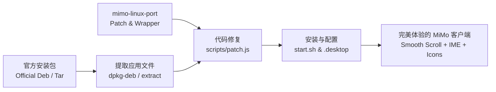

# Xiaomi MiMo Linux Compatibility Port & Patcher (`mimo-linux-port`)

<p align="center">
  <b>让小米 MiMo 桌面端在 Linux (Ubuntu / Debian / Arch / Fedora) 下获得完美的丝滑体验</b><br>
  A robust compatibility layer, launcher, and bugfix patcher for Xiaomi MiMo Desktop on Linux.
</p>

<p align="center">
  
  
  
  
</p>

---

[中文说明 (Chinese)](#中文说明) | [English Documentation](#english)

---

<a name="中文说明"></a>
## 🇨🇳 中文说明

### 项目背景与解决的痛点

小米 MiMo 是一款强大的 AI 编程与智能开发桌面工具。但在 Linux 环境下运行时，官方 Electron 客户端存在以下数个严重影响日常使用的体验问题：

1. **聊天窗口视口强制吸底 / 滚动回弹 (Scroll Rubber-Banding)**：
   - **现象**：官方客户端在接收消息或 DOM 状态微调时，每秒触发高达 19 次 `pinNow` 强行拉至最底部的循环。当用户试图往上滚屏查看历史代码或对话时，视口会瞬间被强行拽回最新消息，根本无法阅读历史。
   - **修复**：重构 `ThreadView` 滚动几何与脱离判定，当检测到向上滚轮 (`deltaY < 0`) 或视口距离底部超过阈值时，立即解脱 `following` 状态，彻底杜绝回弹。
2. **历史消息点击焦点劫持 (Focus Stealing)**：
   - **现象**：点击历史消息试图复制某行代码时，焦点会被强制移至底部的输入框。
   - **修复**：增加视口跟随条件判断，仅在处于底部跟随状态时才允许自动聚焦。
3. **Wayland 与输入法 (IBus / Fcitx) 选词框异常**：
   - **现象**：在 Ubuntu 24.04 (GNOME 46) 等 Wayland 环境下，Electron 原生 Wayland 模式常出现输入法候选框丢失、按键丢失甚至白屏。
   - **修复**：启动器提供智能 Ozone 平台调度，默认使用经过调优的 XWayland 模式，100% 保证输入法候选框对齐与平滑输入；同时支持用户通过环境变量开启原生 Wayland `text-input-v3`。
4. **桌面图标与系统集成缺失**：
   - **现象**：官方更新包或解压后缺少高清 Dock / 启动器图标，任务栏为通用齿轮或空白图标。
   - **修复**：从官方资源中智能提取生成 48x48 至 1024x1024 全套 Hi-Res 矢量与像素图标，完美适配 GNOME / KDE 启动器与托盘。

---

### 开源合规与法律说明 (Patcher 模式)

> [!IMPORTANT]
> **本仓库严格遵循开源法律合规要求，不包含、不托管、亦不分发任何小米官方闭源二进制文件或受版权保护的专属资源。**
> 
> 本项目采用与 Arch Linux **AUR (PKGBUILD)** 及社区补丁工具完全一致的 **Patcher 架构**：
> - 仓库内仅包含纯文本补丁脚本 (`patch.js`)、启动包装器 (`start.sh`) 以及自动化打包脚本。
> - 所有闭源客户端文件均在用户本地由官方安装包提取并进行现场适配修补。

---

### 架构流程



---

### 快速开始

#### 方法一：一键全自动安装 (极力推荐)

即便您本地是全新的纯净 Linux 系统、没有任何 MiMo 安装包，也只需运行这一条命令：

```bash
git clone https://github.com/Nelson-zhou/mimo-linux-port.git
cd mimo-linux-port
sudo ./scripts/install.sh
```

**工作流程（全自动）**：
1. 脚本自动探测本地包；若本地无安装包，**自动向小米官方 CDN 请求下载最新官方原版 `.deb`**；
2. 自动解包并提取核心代码与官方 Electron 运行时；
3. 现场打入防回弹、防焦点劫持补丁；
4. 自动生成 48px~512px 全套高清桌面图标，注册系统菜单与快捷方式。

> 💡 **手动下载备用**：若您希望自行下载官方原版包，可点击：
> [小米官方 Linux 版 deb 下载直链](https://mimocode-cdn.xiaomimimo.com/mimocode/mimodesktop/XiaomiMiMo-26.909.91205-x64.deb)（官方版本清单：[manifest.json](https://mimocode-cdn.xiaomimimo.com/mimocode/mimodesktop/manifest.json)）。下载后将文件放于当前目录再执行脚本即可。

#### 方法二：一键本地重新打包为 `.deb`

如果您需要生成一个已打好补丁的独立安装包以便离线安装或分发给其他个人设备：

```bash
cd mimo-linux-port
./scripts/build_deb.sh
# 脚本若未指定参数将自动拉取官方最新包并输出: xiaomi-mimo-desktop_xxxx-linux-x64.deb
sudo dpkg -i xiaomi-mimo-desktop_*-linux-x64.deb
```

---

### 环境变量与高级调优

启动器 `/opt/mimo-desktop-cn/start.sh` 支持通过环境变量自定义显示驱动行为：

| 环境变量 | 可选值 | 说明 |
| :--- | :--- | :--- |
| `MIMO_OZONE_PLATFORM` | `x11` (默认) / `wayland` | 默认 `x11` (XWayland) 可保证 100% 稳定的 IBus/Fcitx 中文输入法候选框；设为 `wayland` 启用纯原生 Wayland。 |

---

### 常见问题与闪退排查 (Troubleshooting)

如果在启动时遇到闪退或无法启动，请优先**在终端中直接运行命令查看详细输出**：
```bash
xiaomi-mimo-desktop
# 或直接运行启动脚本
/opt/mimo-desktop-cn/start.sh
```

常见原因与解决方案：
1. **Ubuntu 24.04+ / SUID Sandbox 拦截**：
   - 错误表现：`The SUID sandbox helper binary was found, but is not configured correctly`。
   - 解决方案：`start.sh` 已默认包含 `--no-sandbox` 参数，若直接运行二进制请务必带上该参数。
2. **单实例锁残留导致的静默退出**：
   - 错误表现：点击图标后瞬间消失，终端运行返回码 0。
   - 解决方案：新版 `start.sh` 会自动检测并清理孤儿锁文件；亦可手动执行：
     ```bash
     killall -9 xiaomi-mimo-desktop electron 2>/dev/null
     rm -f ~/.config/XiaomiMiMoDesktop/Singleton*
     ```
3. **缺少系统运行库（`libsecret-1.so.0` / `libxtst` 等）**：
   - 错误表现：`cannot open shared object file: libsecret-1.so.0`。
   - 解决方案：
     - Ubuntu / Debian: `sudo apt install -y libsecret-1-0 libxtst6`
     - Arch Linux: `sudo pacman -S libsecret libxtst`
     - Fedora: `sudo dnf install -y libsecret libXtst`
4. **GPU 硬件加速与显卡驱动冲突**：
   - 解决方案：尝试加上 `--disable-gpu` 启动：`xiaomi-mimo-desktop --disable-gpu`。

---

<a name="english"></a>
## 🌐 English Documentation

### Overview

**Xiaomi MiMo** is a desktop AI programming assistant. When running on Linux, the official Electron packaging encounters several regressions:
- Continuous viewport locking and rubber-banding to bottom during message streaming.
- Keyboard focus stealing on past conversation clicks.
- Input Method Editor (IME) candidate window misalignment under Wayland.
- Incomplete FreeDesktop application launcher and dock icons.

`mimo-linux-port` provides a zero-risk, cleanly separated patcher and runtime environment for Linux users.

### Features
- **Idempotent AST Patcher** (`scripts/patch.js`): Permanently cures scroll lock loops and focus stealing.
- **Robust Launcher** (`scripts/start.sh`): Configures Wayland/XWayland display flags and IME input modules.
- **Packaging Suite** (`scripts/build_deb.sh`): Automated builder to produce clean, reproducible `.deb` packages.
- **Desktop Standards Compliant**: Provides full hicolor icons (48px ~ 1024px), MIME handler, and `.desktop` integration.

### Quick Usage

```bash
# Clone the repository
git clone https://github.com/Nelson-zhou/mimo-linux-port.git
cd mimo-linux-port

# Run automated installer (auto-downloads official deb from Xiaomi CDN if not present)
sudo ./scripts/install.sh

# Or build a standalone patched .deb
./scripts/build_deb.sh
```

---

### License & Disclaimer

- **Code in this repo**: Licensed under the [MIT License](LICENSE).
- **Disclaimer**: This project is an independent community project and is not affiliated with, endorsed by, or sponsored by Xiaomi Corporation. All trademarks and registered trademarks are the property of their respective owners.
